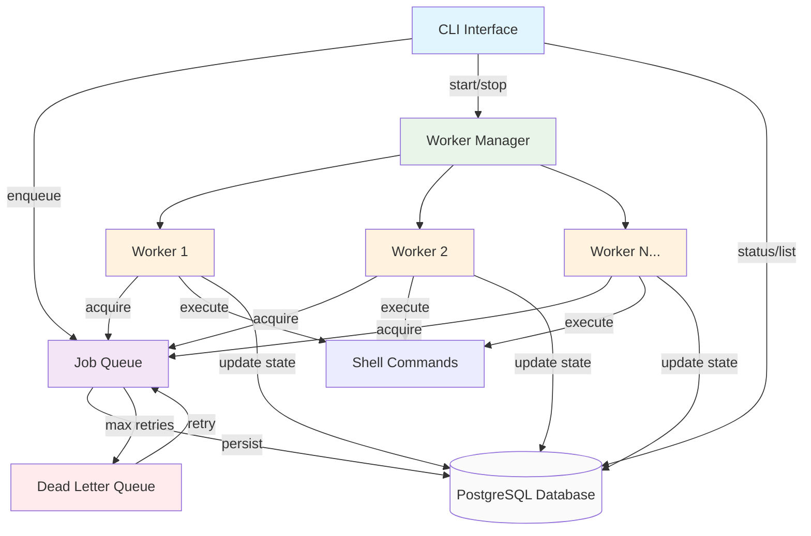
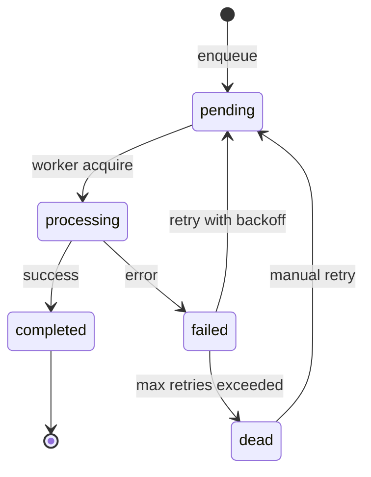
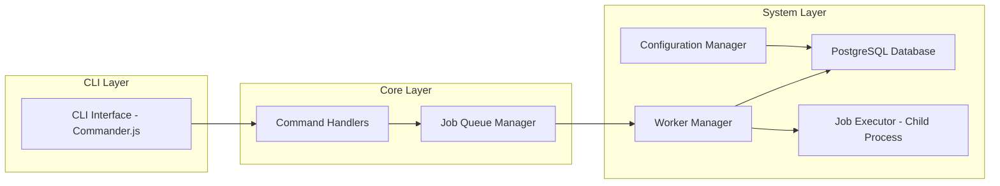

# QueueCTL - CLI Background Job Queue System

A production-grade CLI-based background job queue system built with Node.js and PostgreSQL. Supports multiple workers, exponential backoff retries, dead letter queue, and persistent storage.

## Objective

Build a CLI-based background job queue system called queuectl that manages background jobs with worker processes, handles retries using exponential backoff, and maintains a Dead Letter Queue (DLQ) for permanently failed jobs.

## Features

* Job Queue with multiple states (pending, processing, completed, failed, dead)

* Multiple Worker Processes with parallel execution

* Exponential Backoff Retry mechanism

* Dead Letter Queue (DLQ) for permanent failures

* PostgreSQL persistent storage with concurrent access

* SKIP LOCKED for non-blocking job acquisition

* Graceful Worker Shutdown

* Configurable retry limits and backoff base

* Clean CLI Interface with comprehensive commands

* Production-ready architecture

## System Architecture



## Data Flow

1. CLI Input → Command parsing and validation

2. Job Enqueue → Persistent storage in PostgreSQL

3. Worker Acquisition → SKIP LOCKED for concurrent access

4. Job Execution → Shell command execution with timeout handling

5. State Management → Atomic state transitions

6. Retry Logic → Exponential backoff with configurable base

7. DLQ Management → Manual retry capability for failed jobs

## Job Lifecycle

| **State**     | **Description**                            | **Transition**                            |
|----------------|--------------------------------------------|-------------------------------------------|
| `pending`      | Waiting to be picked up by a worker        | → `processing`                            |
| `processing`   | Currently being executed                   | → `completed` or `failed`                 |
| `completed`    | Successfully executed                      | **Terminal state**                        |
| `failed`       | Failed, but retryable                      | → `pending` (with backoff) or `dead`      |
| `dead`         | Permanently failed (moved to DLQ)          | → `pending` (manual retry)                |

## State Transition Diagram



## Job Specification

Each job must contain at least the following fields:

```
{
  "id": "unique-job-id",
  "command": "echo 'Hello World'",
  "state": "pending",
  "attempts": 0,
  "max_retries": 3,
  "created_at": "2025-11-04T10:30:00Z",
  "updated_at": "2025-11-04T10:30:00Z"
}
```
## Complete Job Schema

| **Field**        | **Type**     | **Required** | **Description**                                      |
|------------------|--------------|---------------|------------------------------------------------------|
| `id`             | string       | Yes           | Unique job identifier                                |
| `command`        | string       | Yes           | Shell command to execute                             |
| `state`          | string       | Yes           | Current state (`pending` / `processing` / `completed` / `failed` / `dead`) |
| `attempts`       | number       | Yes           | Number of execution attempts                         |
| `max_retries`    | number       | Yes           | Maximum retry attempts before DLQ                    |
| `created_at`     | timestamp    | Yes           | Job creation timestamp                               |
| `updated_at`     | timestamp    | Yes           | Last update timestamp                                |
| `run_after`      | timestamp    | Yes           | Earliest execution time (for retries)                |
| `error_message`  | text         | No            | Last error message                                   |
| `output`         | text         | No            | Command execution output                             |
| `locked_by`      | string       | No            | Worker ID holding the lock                           |
| `locked_at`      | timestamp    | No            | Lock acquisition time                                |
| `completed_at`   | timestamp    | No            | Job completion time                                  |

## CLI Commands

| **Category** | **Command Example** | **Description** |
|---------------|----------------------|------------------|
| **Enqueue** | `queuectl enqueue '{"id":"job1","command":"sleep 2"}'` | Add a new job to the queue |
| **Workers** | `queuectl worker start --count 3` | Start one or more workers |
|  | `queuectl worker stop` | Stop running workers gracefully |
| **Status** | `queuectl status` | Show summary of all job states & active workers |
| **List Jobs** | `queuectl list --state pending` | List jobs by state |
| **DLQ** | `queuectl dlq list` / `queuectl dlq retry job1` | View or retry DLQ jobs |
| **Config** | `queuectl config set max-retries 3` | Manage configuration (retry, backoff, etc.) |

## Detailed Command Reference

```
# Enqueue jobs
queuectl enqueue <jobJson>

# Worker management
queuectl worker start [--count <number>]
queuectl worker stop

# Monitoring
queuectl status
queuectl list [--state <state>] [--limit <number>]

# DLQ management
queuectl dlq list
queuectl dlq retry <jobId>

# Configuration
queuectl config set <key> <value>
queuectl config get <key>
queuectl config list
```

## System Requirements

### 1. Job Execution

* Each worker executes specified shell commands

* Exit codes determine success or failure

* Commands that fail or are not found trigger retries

### 2. Retry & Backoff

* Failed jobs retry automatically

* Exponential backoff: delay = base ^ attempts seconds

* Move to DLQ after max_retries exhausted

### 3. Persistence

* Job data persists across restarts

* PostgreSQL with proper indexing and constraints

* Transaction-safe operations

### 4. Worker Management

* Multiple workers process jobs in parallel

* Prevent duplicate processing (SKIP LOCKED)

* Graceful shutdown (finish current job before exit)

### 5. Configuration

* Configurable retry count and backoff base via CLI

* Persistent configuration storage


## Database Design

```jobs``` Table

```
CREATE TABLE jobs (
  id TEXT PRIMARY KEY,
  command TEXT NOT NULL,
  state TEXT DEFAULT 'pending',
  attempts INTEGER DEFAULT 0,
  max_retries INTEGER DEFAULT 3,
  created_at TIMESTAMP DEFAULT NOW(),
  updated_at TIMESTAMP DEFAULT NOW(),
  run_after TIMESTAMP DEFAULT NOW(),
  error_message TEXT,
  output TEXT,
  locked_by TEXT,
  locked_at TIMESTAMP,
  completed_at TIMESTAMP
);
```

```config``` Table
```
CREATE TABLE config (
  key TEXT PRIMARY KEY,
  value TEXT NOT NULL,
  updated_at TIMESTAMP DEFAULT NOW()
);
```

Indexes for Performance
```
CREATE INDEX idx_jobs_state ON jobs(state);
CREATE INDEX idx_jobs_run_after ON jobs(run_after);
CREATE INDEX idx_jobs_locked ON jobs(locked_by, locked_at);
CREATE INDEX idx_jobs_created_at ON jobs(created_at);
```

## Installation


### Prerequisites

* Node.js 16+

* PostgreSQL 12+

## Local Development

```
# Clone repository
git clone <repository-url>
cd queuectl

# Install dependencies
npm install

# Setup environment
cp .env.example .env
# Edit .env with your PostgreSQL credentials

# Initialize database
npm run setup-db

# Run health check
npm run health-check

# Make CLI executable
chmod +x src/cli/index.js
```

## Global Installation

```
npm install -g .
```

## PostgreSQL Setup

```
# Create database and user
sudo -u postgres psql
CREATE USER queuectl_user WITH PASSWORD 'queuectl_password';
CREATE DATABASE queuectl;
GRANT ALL PRIVILEGES ON DATABASE queuectl TO queuectl_user;
\q
```

## Testing

### Run Complete Demo

```
npm run demo
```

## Manual Testing

```
# Test basic workflow
queuectl enqueue '{"id":"test1","command":"echo \"Hello World\""}'
queuectl worker start --count 2
queuectl status
queuectl list --state completed
queuectl worker stop
```

## Expected Test Scenarios

✅ Basic job completes successfully

✅ Failed job retries with backoff and moves to DLQ

✅ Multiple workers process jobs without overlap

✅ Invalid commands fail gracefully

✅ Job data survives restart

## Configuration

* ```max_retries```: Maximum retry attempts before DLQ (default: 3)

* ```exponential_base```: Base for exponential backoff (default: 2)

* ```worker_count```: Default number of workers (default: 1)

* ```concurrency_per_worker```: Jobs processed concurrently per worker (default: 3)

## Configuration Examples

```
queuectl config set max_retries 5
queuectl config set exponential_base 3
queuectl config set concurrency_per_worker 5
queuectl config list
```

## Exponential Backoff

Failed jobs are retried with exponential backoff:

```
delay = base ^ attempts seconds
```

Example with base=2:

* Attempt 1: 2 seconds delay

* Attempt 2: 4 seconds delay

* Attempt 3: 8 seconds delay

## Technical Architecture



## Concurrency Model

* SKIP LOCKED: PostgreSQL feature for non-blocking job acquisition

* Connection Pooling: Efficient database connection management

* Worker Isolation: Each worker operates independently

* Atomic Operations: Database transactions ensure data consistency

## Performance Features

* Non-blocking Architecture: Workers don't block each other

* Efficient Queries: Proper indexing and query optimization

* Connection Pooling: Reuse database connections

* Batch Operations: Acquire multiple jobs in single transaction

* Stale Lock Cleanup: Automatic recovery from worker failures

## Troubleshooting

### Common Issues

#### Database Connection Failed:

* Check PostgreSQL is running

* Verify credentials in ```.env```

* Run ```npm run setup-db```

#### Jobs Not Processing:

* Check workers are running: ```queuectl status```

* Verify job state: ```queuectl list --state pending```

* Check worker logs for errors

#### Permission Errors:

* Ensure Node.js version >= 16

* Run with appropriate permissions

### Debug Commands

```
# Check system health
npm run health-check

# Test worker processing
node scripts/debug-worker.js

# Check database state
psql -U queuectl_user -d queuectl -c "SELECT state, COUNT(*) FROM jobs GROUP BY state;"
```

## Deployment

### Production Considerations

* Use environment-specific configuration

* Set up PostgreSQL connection pooling

* Configure proper logging and monitoring

* Implement backup strategies for job data

* Set up process supervision (PM2, systemd)

## Environment Variables

# .env - Using default PostgreSQL credentials

```
DATABASE_URL=postgresql://postgres:@localhost:5432/queuectl
DB_HOST=localhost
DB_PORT=5432
DB_NAME=queuectl
DB_USER=postgres
DB_PASSWORD=
DB_MAX_CONNECTIONS=20
DB_IDLE_TIMEOUT=30000
DB_CONNECTION_TIMEOUT=10000

NODE_ENV=development
```

## Monitoring & Metrics

### Key Metrics to Track

* Jobs processed per minute

* Average job execution time

* Failure rates and retry counts

* DLQ size and growth

* Worker utilization and concurrency

### Integration Points

* Logging (Winston, Pino)

* Metrics (Prometheus, StatsD)

* Alerting (PagerDuty, OpsGenie)

* Dashboard (Grafana, Kibana)

## Development Setup

```
npm install
npm run setup-db
npm test
npm run demo
```

## License

MIT License - see LICENSE file for details.

## Roadmap

* Job timeout handling

* Job priority queues

* Scheduled/delayed jobs (```run_at```)

* Job output logging to files

* Metrics and execution stats

* Web dashboard for monitoring

* REST API interface

* Kubernetes deployment templates

QueueCTL - Production-ready background job processing with the simplicity of CLI and power of PostgreSQL.